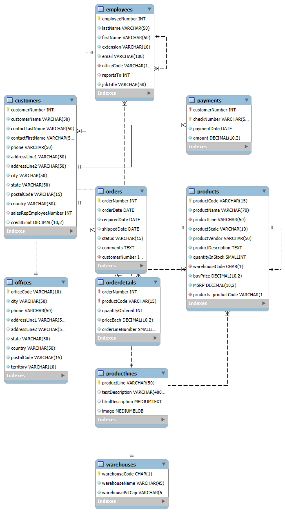

# 🧾 Mint Classics SQL Inventory & Sales Analysis

> **Author:** Naghmeh Naderi  
> **Tools Used:** MySQL, MySQL Workbench  
> **Database:** MintClassics Sample Database (Relational)
## 📐 EER Diagram

## 📌 Project Overview

This project provides a detailed SQL-based analysis of the **Mint Classics** company's inventory, sales performance, and warehouse operations. The company is considering closing one of its warehouses and seeks data-driven recommendations to guide that decision.  

Using SQL queries, I analyzed product demand, stock levels, revenue by product line, and warehouse efficiency based on historical sales and order statuses.

---

## 📂 Project Structure

---

## ⚙️ How to Use

### ✅ Requirements:
- MySQL installed (version 8+ recommended)
- MySQL Workbench

### 🛠️ Setup:
1. Download or clone this repository.
2. Open **MySQL Workbench**.
3. Import `mintclassicsDB.sql` using:
   - **Server > Data Import > Import from Self-Contained File**
4. Open `analysis_queries.sql`.
5. Run each query section by section to explore the data.

---

## 📊 Analysis Summary

### 🔍 Query 1 – Low-Demand, High-Cost, High-Stock Products
Identifies items that have **high inventory**, **low order frequency**, and **high unit cost**.

**Example Result:**
📌 Insight: Products like this take up valuable warehouse space without generating revenue.

---

### ⚠️ Query 2 – Stock Reduction Simulation (5%)
Tests what happens if all product stocks are reduced by **5%**. We check if that causes shortages.

**Risky Products Identified:**
- `1960 BSA Gold Star DBD34`
- `1968 Ford Mustang`

📌 Insight: These items may fall below acceptable buffer levels after reduction and should be reviewed manually.

---

### 🏬 Query 3 – Warehouse Utilization by Order Status

Compares total stock vs. total items shipped for each warehouse and order status (`Shipped`, `Resolved`, `Disputed`).

**Example Output:**

| Warehouse | Total Stock | Status     | Products Shipped |
|-----------|-------------|------------|------------------|
| B         | 5,500,568   | Shipped    | 33,349           |
| A         | 3,416,646   | Shipped    | 22,762           |
| D         | 1,965,864   | Shipped    | 20,015           |

📌 Insight:  
Warehouse **D** ships nearly as much as larger warehouses with significantly less stock.  
Warehouse **B** is large and active, but may have excess capacity.  
💡 Consolidating **A and C** could be viable.

---

### 💰 Query 4 – Revenue by Product Line

Calculates total revenue from each product line.

**Results:**

📌 Insight: **Classic and Vintage Cars** are the most profitable lines. Focusing resources here can maximize ROI.

---

## 📈 Recommendations

- 📦 **Consider consolidating warehouses A and C** based on similar size and performance.
- 🧊 **Avoid closing Warehouse D**, which shows high shipment throughput despite lower stock.
- 🔄 **Regularly review underperforming products** with high stock and low sales.
- 📉 **Proceed cautiously with stock reduction** on items that are close to reorder thresholds.

---

## 📁 Files Included

| File                    | Description                          |
|-------------------------|--------------------------------------|
| `analysis_queries.sql`  | Main SQL script (well-commented)     |
| `mintclassicsDB.sql`    | Optional – full DB schema & data     |
| `README.md`             | Documentation for the GitHub repo    |

